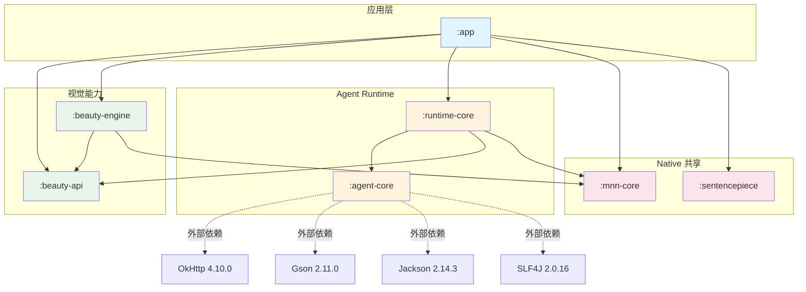
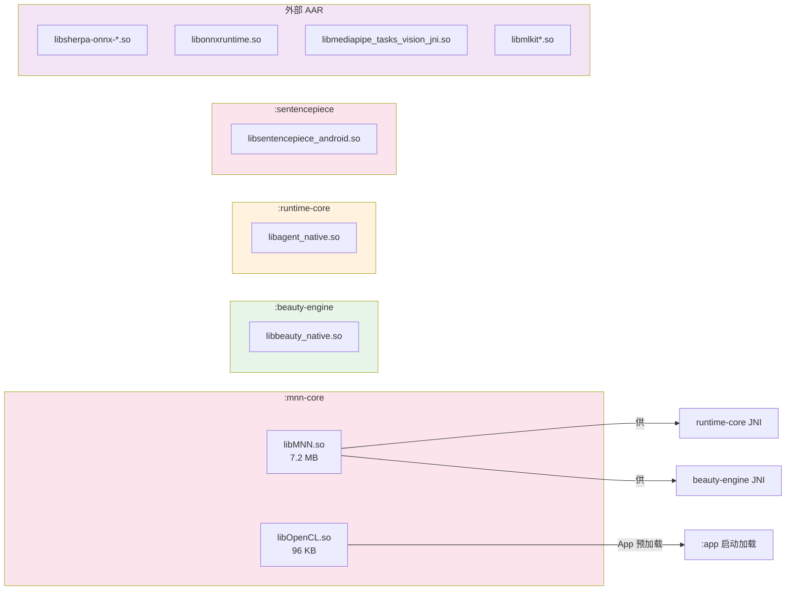

# langchain4android 模块架构图

> **边界声明（Boundary Statement）**
> - 本文档描述 PicMe Demo 工程当前的 Gradle 模块划分、依赖方向与 Native SO 归属。
> - 产品目标与验收口径以 [`../01-PRODUCT/FEATURES.md`](../01-PRODUCT/FEATURES.md) 为准。
> - 顶层治理规则（角色协作、全局红线、文档流程）以根目录 [`AGENTS.md`](../../AGENTS.md) 为准。

**模块定位**：模块分层与依赖关系可视化
**主要维护者**：[RD] 全栈工程师 / [CR] 规范守护者
**阅读对象**：CO、PM、RD、CR、QA、AI Agent
**版本**：1.0
**最后更新**：2026-07-06
**状态**：生效中

---

## 1. 模块清单

| 模块 | 类型 | 主要职责 | 关键产物 |
|------|------|----------|----------|
| `:app` | Android Application | PicMe 主应用：Compose UI、页面导航、手动 DI、模块组装 | `picme.apk` |
| `:agent-core` | Android Java Library | LangChain4j 风格 LLM 基础设施：ChatModel、@Tool、AiServices、ChatMemory、OpenAI 协议客户端 | `agent-core.aar` |
| `:runtime-core` | Android Library | Agent Runtime：AgentOrchestrator、CapabilityRegistry、PrivacyGuard、本地/远程推理管道、语音 ASR | `runtime-core.aar` |
| `:beauty-api` | Android Library | 美颜系统纯契约层：BeautySettings、FaceDetector、FilterType 等 | `beauty-api.aar` |
| `:beauty-engine` | Android Library | 自研 GPU 美颜引擎：OpenGL ES + EGL 渲染管线、人脸检测适配器 | `beauty-engine.aar` |
| `:mnn-core` | Android Library | MNN 推理运行时共享模块：`libMNN.so`、`libOpenCL.so`、MnnResourceManager、MnnGlobalReleaseLock | `mnn-core.aar` |
| `:sentencepiece` | Android Library | SentencePiece tokenizer JNI 封装：`libsentencepiece_android.so` | `sentencepiece.aar` |

---

## 2. 模块依赖图



### 依赖方向说明

- **无循环依赖**：所有模块依赖构成有向无环图（DAG）。
- **`:beauty-engine` 不再依赖 `:runtime-core`**：通过 `:mnn-core` 共享 MNN 资源后，视觉引擎与 Agent Runtime 解耦。
- **`:app` 直接依赖 `:mnn-core`**：因为 `PicMeApplication` 和 `CameraScreen` 直接调用 `MnnResourceManager`。
- **`:agent-core` 零业务依赖**：不依赖任何 PicMe 业务模块，可独立作为 JitPack 库发布。

---

## 3. Native SO 归属图



### SO 归属说明

| SO | 归属模块 |  consumers | 备注 |
|----|----------|-----------|------|
| `libMNN.so` | `:mnn-core` | `:runtime-core`、`:beauty-engine` | 唯一来源，避免 AAR 级重复 |
| `libOpenCL.so` | `:mnn-core` | `:app`（启动预加载） | OpenCL ICD Loader |
| `libagent_native.so` | `:runtime-core` | `:app` | LLM JNI 桥接 |
| `libbeauty_native.so` | `:beauty-engine` | `:app` | 人脸检测 JNI 桥接 |
| `libsentencepiece_android.so` | `:sentencepiece` | `:app` | 分词器 JNI |
| `libonnxruntime.so` | 外部（Sherpa-ONNX / onnxruntime-android） | `:app` | 通过 `pickFirsts` 解决双来源冲突 |
| `libsherpa-onnx-*.so` | Sherpa-ONNX AAR | `:app` | ASR / KWS |
| `libmediapipe_tasks_vision_jni.so` | MediaPipe AAR | `:app` | 人脸 landmark |
| `libmlkit*.so` | ML Kit AAR | `:app` | OCR / 图像标签 / 人脸检测 |

---

## 4. 关键类所在模块

| 类 / 对象 | 所在模块 | 包路径 |
|-----------|----------|--------|
| `AgentOrchestrator` | `:runtime-core` | `com.mamba.picme.agent.core.facade` |
| `CapabilityRegistry` | `:runtime-core` | `com.mamba.picme.agent.core.runtime.capability` |
| `PrivacyGuard` | `:runtime-core` | `com.mamba.picme.agent.core.runtime.policy` |
| `MemoryManager` | `:runtime-core` | `com.mamba.picme.agent.core.platform.storage` |
| `SceneManager` | `:runtime-core` | `com.mamba.picme.agent.core.runtime.state` |
| `RemoteReActAgent` | `:runtime-core` | `com.mamba.picme.agent.core.inference.remote.react` |
| `LocalLlmEngine` / `MnnLlmClient` | `:runtime-core` | `com.mamba.picme.agent.core.inference.local.llm` |
| `ChatModel` / `StreamingChatModel` | `:agent-core` | `com.mamba.model.chat` |
| `OpenAiChatModel` | `:agent-core` | `com.mamba.model.openai` |
| `ToolSpecification` | `:agent-core` | `com.mamba.agent.tool` |
| `MnnResourceManager` / `MnnGlobalReleaseLock` | `:mnn-core` | `com.mamba.picme.mnn` |
| `MnnFaceDetector` / `MnnFaceEmbedder` | `:beauty-engine` | `com.mamba.picme.beauty.internal.facedetect.mnn` |
| `FaceDetectorManager` | `:beauty-engine` | `com.mamba.picme.beauty.internal.facedetect` |
| `BeautyPreviewEngine` | `:beauty-engine` | `com.mamba.picme.beauty.api` |
| `SentencePieceProcessor` | `:sentencepiece` | `com.mamba.picme.sentencepiece` |

---

## 5. 架构红线

```mermaid
flowchart LR
    subgraph Rules["依赖方向红线"]
        R1["`:beauty-engine` 禁止依赖 `:runtime-core`"]
        R2["`:agent-core` 禁止依赖 `:app` / `:runtime-core` 业务类型"]
        R3["`:beauty-api` 零第三方依赖"]
        R4["`:app` 禁止直接依赖 `beauty-engine:render/` 内部实现"]
        R5["`:mnn-core` 禁止依赖 `:runtime-core` / `:beauty-engine`"]
    end
```

| 红线 | 定义 | 验证方式 |
|------|------|----------|
| **视觉-运行时解耦** | `:beauty-engine` 不直接依赖 `:runtime-core` | `./gradlew :beauty-engine:dependencies` 无 `:runtime-core` |
| **基础库独立** | `:agent-core` 不依赖 PicMe 业务模块 | 源码 import 扫描 |
| **API 契约纯净** | `:beauty-api` 仅 Kotlin stdlib + Android graphics | 依赖树检查 |
| **Native 共享收敛** | MNN SO 由 `:mnn-core` 唯一提供 | AAR 内容检查 |

---

## 6. 编译验证

```bash
# 全量构建
./gradlew :app:assembleDebug

# 反向依赖检查
./gradlew :beauty-engine:dependencies --configuration releaseRuntimeClasspath | grep "runtime-core" || echo "PASS: no runtime-core dependency"
```

> **维护者**：RD Agent
> **最后更新**：2026-07-06
